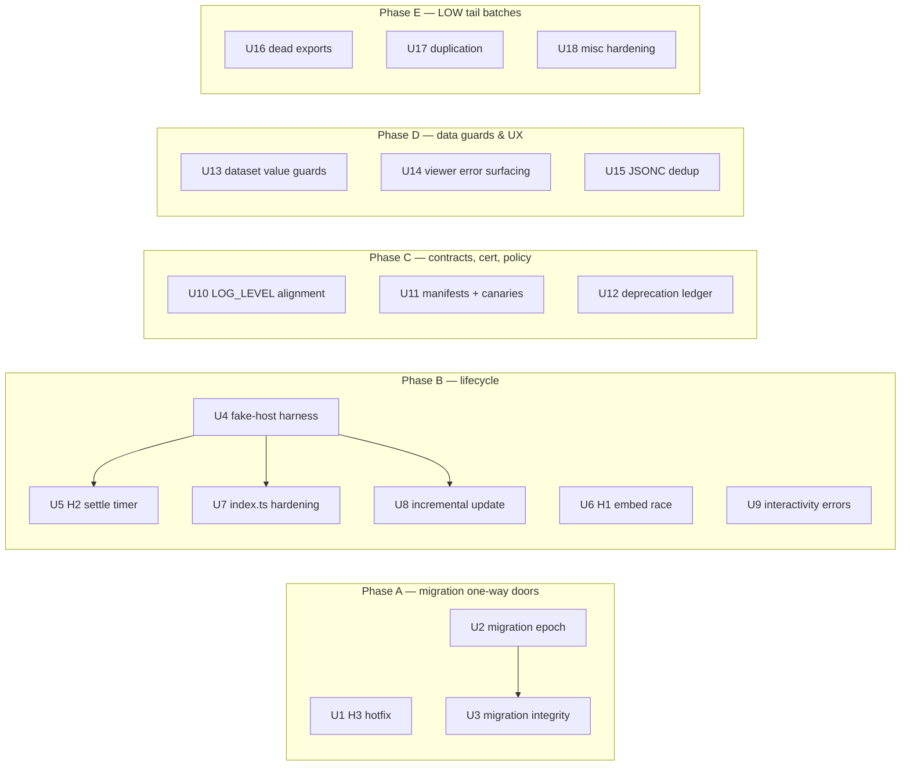

# fix: 2026-07-03 Audit Remediation Program with Protective Infrastructure

## Summary

Remediate every finding from the 2026-07-03 read-only audit (3 HIGH, 17 MEDIUM, ~40 LOW) as 18 independently-landable PR-sized units on `next`, sequenced so one-way doors (persisted-state migration integrity) land first, lifecycle fixes land under the protection of a new minimal fake-host harness, and each fix class is locked in by canary tests. Four validated ideation ideas ride along as protective infrastructure: the fake-host lifecycle harness (#1), a versioned `stateManagement` migration epoch (#2), a 2.0 deprecation ledger (#3), and an invariant canary pack (#5).

---

## Problem Frame

A full read-only audit of the codebase ([docs/audit-findings.md](../audit-findings.md)) surfaced traced, confirmed defects concentrated in the rendering lifecycle, Vega embed race handling, legacy persisted-state migration, and error propagation — plus a long quality tail. Independently, an abandoned pre-2.0 refactoring ideation pass ([docs/ideation/2026-06-13-pre-2.0-refactoring-ideation.md](../ideation/2026-06-13-pre-2.0-refactoring-ideation.md)) was cross-validated as still byte-accurate: its top-ranked infrastructure ideas predicted exactly the defect classes the audit found. The 2.0 release cut (`next` → `main`) is imminent; whatever migration shape ships at the cut locks into users' saved reports permanently. The goal is to ship 2.0 with as many remediations as possible, chipped off as independent PRs.

---

## Requirements

- R1. All three HIGH defects fixed: H1 (stale `vegaEmbed()` promise overwrites newer embed), H2 (500ms settle timer emits `renderingFinished` mid-render), H3 (legacy migration reads pre-migration Zustand snapshot).
- R2. All 17 MEDIUM findings remediated (M1–M17 per the audit report).
- R3. The LOW tail (L1–L17 + P5-D1–D6 + P5-E1–E10) remediated in batched cleanup units. Excluded by design, per Scope Boundaries: L18 (no action per the audit; optional U11 canary extension) and P5-D7 (intentional two-store mirroring).
- R4. A minimal fake-host integration harness exists for `update()`/lifecycle orchestration, in the shape the segmented-fetch solution doc specifies (mocked state slices + fake `#host`, node env, no `@testing-library/react`), and the lifecycle fixes are covered by harness scenarios.
- R5. The persisted `stateManagement` payload carries a schema version, migrations run through an ordered registry, and a captured-payload fixture corpus replays through the pipeline in CI.
- R6. Invariant canaries convert documented contracts into CI failures: powerbi-compat singleton pairing, safety-net bound ≤ 10s, build-script invariants.
- R7. A checked-in 2.0 deprecation ledger stamps every shim/`@deprecated` symbol with introduced / warns-since / removal-target, and records the `data_drilldown` flag decision.
- R8. Every unit is an independently-landable PR against `next`; `main` is never touched.
- R9. Certification constraints preserved throughout: `SAFETY_NET_BOUND_MS` stays 10_000 (not tunable), `.env` untouched, `validate-config-for-commit` never wired into `package-alpha`/`package-beta`, no `console.error` on certified paths, vega-embed actions workaround untouched.

---

## Scope Boundaries

- No change to the 10s safety-net bound, `.env` flags, packaging-channel scripts, or the vega-embed `actions: false` double-layer workaround.
- No general complexity-reduction refactors of flagged hotspot components (`DataTab`, `SettingsPane`, `EditorArea`, `useEditorPaneLayout`) beyond what fixes require — test backfill is limited to interactivity-manager and cross-filter-expressions, which the fixes touch anyway.
- No decomposition of `src/index.ts`, no sync-layer collapse, no Monaco→CodeMirror work, no const-enum codegen (all explicitly rejected/post-2.0 in the ideation doc).
- The known-deliberate segmented-fetch trade-offs (blank-on-cold-interrupt; mid-fetch filter dropped) are not "fixed" — they are documented decisions.
- Audit finding L18 (eslint boundaries blind spots) requires no action per the audit; noted in U11 as an optional canary extension only.

### Deferred to Follow-Up Work

- Dissolving `@deneb-viz/json-processing` entirely and colocating its remaining methods in more suitable packages — a standing direction this program honors (U15/U16/U17 only move the pieces their findings touch) but does not complete.
- Ideation idea #4 (mirrors sweep — mechanize the 22 prose contracts): separate follow-up program; U15/U17 resolve the two mirror instances their fixes touch, nothing more.
- Ideation idea #6 (30k-row pipeline benchmark with budget gates): follow-up; the U12 manual checklist R9 step covers the release.
- Ideation idea #7 (API surface freeze / barrel narrowing): follow-up; U16's dead-export deletions shrink the accidental surface but no api-extractor tooling lands here.
- `/ce-compound` capture of new learnings for cross-filter error handling and cert-config drift (identified as docs/solutions coverage gaps) after remediation lands.

---

## Context & Research

### Relevant Code and Patterns

- `src/lib/rendering-lifecycle/coordinator.ts` — single-owner coordinator; all `rendering*` emissions route through it; map-presence exactly-once guard; supersede-prior-as-failed; sync `*Current` vs async `*PendingRender` surfaces; DI seams (`emitter`/`scheduler`/`observer`) are the harness attachment points.
- `src/lib/dataset/resolve-dataset-update-action.ts` pattern (pure decision function + orchestrator dispatch with `never`-exhaustiveness) — the shape U4's harness drives and U7's exhaustiveness guard extends.
- `src/lib/state/create-slice-sync.ts` + `src/lib/state/project-sync-mappings.ts` — pending-persist Map with `deepEqual` confirmation and `serializeForPersistence`; any new/changed synced key must go through this path (21-test suite at `src/lib/state/__test__/create-slice-sync.test.ts`).
- `packages/app-core/src/__tests__/architecture-boundaries.test.ts` — in-repo precedent for invariant canary tests (U11).
- `packages/app-core/src/features/debug-area/components/dataset-viewer/data-tab.tsx:324-330` — documented same-instance view-capture pattern for listener teardown (U18/L4 mirrors this).
- `src/lib/interactivity/tooltip.ts:48-50` — lazy store-read-at-invocation pattern (the fix shape for M1).
- `packages/app-core/src/features/visual-viewer/incremental-update.ts:106-122` — dual-channel Vega error handling precedent (the fix shape for M6).

### Institutional Learnings

- `docs/solutions/architecture-patterns/rendering-lifecycle-coordinator-single-owner-2026-07-03.md` — the seven coordinator properties U5/U7 must preserve. **Its settle-timer paragraph claims the 500ms close is safe via the exactly-once guard; the audit disproved this for the slow-render ordering. U5 revises that paragraph.** Also: `renderingFinished` timing does not influence host iframe expansion (already proven; don't re-derive).
- `docs/solutions/logic-errors/segmented-fetch-viewer-editor-transition-quirks-2026-05-27.md` — specifies the harness shape (mocked slices + fake `#host`, node env, no RTL) and the defensive-try/catch-around-host-calls checklist; async setters must never strand a transient flag (M4's class).
- `docs/solutions/logic-errors/stale-echo-triple-render-on-apply-2026-04-10.md` — 5s pending-persist echo window; migrations must be idempotent against a stale echo of their own persist (U2/U3).
- `docs/solutions/best-practices/validate-migrations-on-matching-channel-builds-2026-06-03.md` — fixture replay must distinguish "empty objects because cross-GUID" from "genuinely unversioned legacy spec"; all migration smoke tests channel-matched (U2).
- `docs/solutions/logic-errors/focus-mode-viewport-overwrites-persisted-dimensions-2026-04-16.md` — host option flags arrive `undefined`; sticky-flag pattern; every `stateManagement` writer needs a mode gate (U3, U4 fixtures).
- `docs/solutions/best-practices/lifecycle-owns-effect-rebind-identity-token-2026-04-28.md` — `renderId` has exactly one writer (`handleEmbed`); U6's generation guard must not introduce a second (it is hook-internal, not a store token).
- `docs/solutions/ui-bugs/freeze-on-viewer-editor-transition-2026-05-01.md` + `viewer-bounce-on-editor-exit-2026-05-04.md` — harness fixture requirements: host reports viewport before iframe resize; fractional viewport widths; `isInFocus: undefined`.
- `docs/solutions/best-practices/extract-shared-semantics-to-avoid-dual-maintenance-2026-04-24.md` — dedup shape: pure helper both paths import; behavioural tests as the contract; no cross-site consistency tests; narrow keyed types (U15, U17).

### External References

- None required — every defect carries traced in-repo evidence and a fix direction; no new technology introduced.

---

## Key Technical Decisions

- **One-way doors first**: migration-integrity units (U1–U3) sequence ahead of everything, because whatever migration shape exists at the cut locks into saved reports. H3 (U1) is small and independent, so it lands before the epoch rather than waiting on it.
- **Harness before lifecycle fixes**: H2/M4/M7/M8 fixes wait for U4's harness so each lands with a scenario that fails without it. Exception: H1/M2 (U6) is a vega-react hook race, unit-testable in isolation — it does not wait.
- **Settle-timer fix lives in the coordinator, not app.tsx**: the coordinator gains a `renderStarted`-aware close variant mirroring the safety-net's existing defer logic, preserving the single-owner property. app.tsx switches to the new variant; no state consultation outside the coordinator.
- **De-`async` the setters rather than awaiting them**: removing the `async` keyword from zero-await setters (M4) restores synchronous throw propagation into `update()`'s existing catch → `coordinator.failCurrent` — the smallest change that restores the truthful-or-loud invariant. Callers are audited for promise-shape dependence.
- **Generation token, not AbortController, for the embed race (H1)**: `vegaEmbed()` is not abortable; a per-effect-run generation counter checked at resolution (finalize-and-bail when stale) is sufficient and keeps `renderId`'s single-writer rule intact.
- **Migration epoch = version stamp + ordered registry owning all version comparison, with two migration classes** — load-time payload-shape entries, and first-dataview data-dependent entries (the support-field stamping, which needs DataView/`jsonSpec` context) — for the `stateManagement` payload only (not the full settings model). Partial persisted states are merged (`{...defaults, ...existing}`), never replaced; all stamps commit in a single store update so the sync layer emits one batched persist.
- **LOG_LEVEL drift closed on both sides (M14)**: the runtime treats ANY value that fails to parse as a recognized level — absent, empty, or garbage — as `NONE` (fail-closed in production; the current fallback returns INFO for the whole unrecognized-input class, not just the empty string), and the validator treats a missing variable as an error (fail-loud at packaging). Dev builds set `LOG_LEVEL` explicitly in `.env` to get logging — documented in DEVELOPMENT.md.
- **LOW tail batched by mechanism, not severity**: dead exports (U16), duplication (U17), and misc async/hardening guards (U18) each form one reviewable PR with a single review lens.
- **UNVERIFIED audit items resolve inside their owning unit** (Vega `finalize()` semantics in U6; `launchUrl` scheme handling in U18; export-intent questions in U16) — each unit's first task is closing its own open question.
- **`@deneb-viz/json-processing` is a legacy dumping ground slated for eventual dissolution** (methods to be colocated in more suitable packages). Cleanup units touching it (U15, U16, U17) therefore move logic OUT of it or down to `@deneb-viz/utils`, and never add new public surface to it; any thin decorator left behind is transitional, not a destination.

---

## Open Questions

### Resolved During Planning

- Harness shape: node-env fake `IVisualHost` + mocked slices, no RTL — pre-decided by the segmented-fetch solution doc's Known follow-up.
- Whether H2's fix should suppress the settle timer entirely: no — the settle path is the designed close for non-Vega-affecting updates; it only needs to defer once `markPendingRenderStarted` has fired (mirroring the safety-net).
- Where the JSONC parse core lands (M16): `@deneb-viz/utils` — it sits below both current implementations in the dependency graph.

### Deferred to Implementation

- Exact registry entry shape and fixture-corpus format for U2 — depends on what captured pre-2.0 payloads look like once collected.
- Whether Vega's `view.finalize()` fully neutralizes old-view listeners (U6 verifies; determines whether L4's fix is required or hygiene).
- Whether the Power BI host rejects non-http(s) `launchUrl` schemes (U18 verifies; determines L10's severity).
- `data_drilldown` ship/park/delete — a roadmap decision the user makes during U12; the ledger records whatever is decided.
- Whether L9's fail-closed loader default changes web-client-sample behavior — U18 decides between requiring a loader in the platform contract vs. a restrictive default.

---

## High-Level Technical Design

> *This illustrates the intended approach and is directional guidance for review, not implementation specification. The implementing agent should treat it as context, not code to reproduce.*

Unit dependency graph (arrows = "must land first"; unmarked units are independent):

Phases order by release-coupling (A hardest-coupled, E loosest), but units in different phases can interleave freely — the only hard edges are the arrows above. If the 2.0 cut arrives mid-program, everything in A plus whatever else has landed ships; nothing in C–E blocks the cut except U12 (ledger value evaporates post-cut).

---

## Implementation Units

### Phase A — Migration one-way doors

- U1. **H3 hotfix: migration pass honours its own stamped values**

**Goal:** Pre-2.0 specs with field parameters render with the correct (unconsolidated) row shape in the same mapping pass the legacy migration runs in — including reading view, where the bug currently never heals.

**Requirements:** R1 (H3)

**Dependencies:** None

**Files:**
- Modify: `src/lib/dataset/processing.ts`
- Test: `src/lib/dataset/__test__/` (new or extended migration-pass test)

**Approach:**
- After the legacy-migration block, the mapping pass must use the values the migration just stamped — either re-read fresh state or derive locally (`legacy ? false : persisted ?? true`). The local derivation is preferred: it works identically in read mode where persistence is suppressed.

**Patterns to follow:** the audit's traced chain (processing.ts:254 snapshot → :285-287 stamps → :303 stale read).

**Test scenarios:**
- Happy path: legacy spec (denebMetaVersion < 2) with field-parameter groups → rows carry flat component field names, not consolidated arrays, on the first mapping pass.
- Edge case: read mode (persistence suppressed) with the same legacy spec → correct shape on every pass, not just the first.
- Happy path: non-legacy spec with `consolidateFieldParameters: true` persisted → consolidation still applies (no regression).
- Edge case: legacy spec without field parameters → migration stamps values, row shape unchanged.

**Verification:** a pre-2.0 field-parameter fixture renders identical row shapes in edit mode (first pass) and read mode (every pass); existing dataset tests green.

---

- U2. **Migration epoch: versioned `stateManagement` schema + ordered registry + fixture replay**

**Goal:** Every future change to persisted-state shape goes through one ordered, tested migration pipeline; 2.0 is the last unversioned shape the code ever has to sniff.

**Requirements:** R5

**Dependencies:** None (U1 lands first by sequencing preference, not necessity)

**Files:**
- Modify: `src/lib/persistence/migration.ts`, `src/lib/persistence/model/settings-state-management.ts`
- Create: fixture corpus directory under `src/lib/persistence/__test__/fixtures/`
- Test: `src/lib/persistence/__test__/` (registry + replay tests)

**Approach:**
- Add a schema-version stamp to the `stateManagement` payload and an ordered `{fromVersion, migrate}` registry that owns all version comparison. Two explicit migration classes: (a) load-time payload-shape migrations, applied in sequence on load from `migration.ts`; (b) first-dataview data-dependent migrations — the support-field legacy stamping, which computes per-field defaults from DataView columns and needs `jsonSpec` context unavailable at load — registered against the same version stamp but executed from the dataset mapping pass. The registry decides *whether* a migration runs in both classes; class (b) supplies its own execution point. U3 owns the processing.ts stamping-block edits; U2 provides the registration seam and version stamp.
- Fixture replay: captured pre-2.0 persisted payloads (including partially-populated ones) run through the full pipeline in CI. Fixtures must distinguish "empty objects because cross-GUID" from "genuinely unversioned legacy spec" (validate-migrations-on-matching-channel-builds learning).
- Migrations must be idempotent against the sync layer's 5s pending-persist echo window (stale-echo learning): re-running any entry on already-migrated state is a no-op.

**Execution note:** test-first — write the replay fixtures and registry contract tests before restructuring `migration.ts`.

**Test scenarios:**
- Happy path: unversioned legacy payload → registry applies 0→2 → stamped, correct shape.
- Happy path: current-version payload → registry no-ops, byte-identical output.
- Edge case: partially-populated payload (config present, metaVersion absent — M10's split) → migration completes without wiping the present keys.
- Edge case: replay of a migration's own stale persist echo → no-op, no double-application.
- Error path: corrupt JSON in a persisted key → migration surfaces a signal (ties into U3/L16), does not silently reset.
- Integration: full pipeline replay of each fixture in the corpus produces the expected final shape (snapshot assertions).

**Verification:** all fixtures replay green in CI (via the `test:root` pipeline entry wired in U4 — wire it in this unit instead if U2 lands first); a whole-`src` sweep (not just migration.ts) finds no version-gate patterns for the `stateManagement`/`denebMetaVersion` shape (`isLegacySpec`, `denebMetaVersion` comparisons) outside the registry's ownership — the unrelated `CONTEXT_MENU_SPLIT_VERSION` and `denebVersion`/vega-output gates are out of scope for this unit; channel-matched manual smoke noted for the release checklist (fixtures reduce but don't eliminate it).

---

- U3. **Support-field migration integrity: merge, single-persist, transactional commit**

**Goal:** The legacy support-field migration can no longer wipe user customisations, commit half its state, or mask dataset failures.

**Requirements:** R2 (M10, M11, M12), R3 (L16)

**Dependencies:** U2 (U2 defines the version stamp and the data-dependent registration seam that U3's stamping writes through; U3 owns the processing.ts stamping-block edits)

**Files:**
- Modify: `src/lib/dataset/processing.ts`, `src/lib/state/project-sync-mappings.ts`, `packages/app-core/src/state/project.ts`, `packages/app-core/src/lib/project/utils.ts`
- Test: extend `src/lib/state/__test__/create-slice-sync.test.ts`; app-core project-slice tests

**Approach:**
- M10: merge existing explicit config entries over migrated defaults (`{...migratedConfig, ...existingConfig}`); treat a non-empty persisted `supportFieldConfiguration` as non-legacy evidence; stamp all properties in one store update so the subscriber emits one batched persist (through `serializeForPersistence` — never bypass the pending-persist path).
- M11: move the migration commit after successful row building (or make it compensable); route mapping-pass failures into a durable compilation-slice error instead of console-only `logError`.
- M12: compute `isProjectInitialized` on the merged state, not the partial sync payload.
- L16: corrupt persisted `supportFieldConfiguration` JSON surfaces a durable warning instead of silently degrading to `{}`.

**Patterns to follow:** pending-persist Map + `serializeForPersistence` (stale-echo doc); mode-gated `stateManagement` writers (focus-mode doc).

**Test scenarios:**
- Happy path: legacy spec, no prior config → migration stamps defaults, one persist call observed.
- Edge case (M10): partial persisted state (config stamped, metaVersion 0) with interim user edits → re-migration preserves the edits.
- Error path (M11): row building throws after migration block → dataset error surfaced durably AND migration state not half-committed (or committed compensably).
- Edge case (M12): partial inbound sync of an unrelated key (`logLevel`) on a brand-new visual → `__isInitialized__` stays false; Create dialog still auto-opens.
- Error path (L16): corrupt config JSON → user-visible warning; flags degrade predictably.
- Integration: three-property stamp arrives at the fake host as a single `persistProjectProperties` call.

**Verification:** the M10 session-interruption scenario (persist 1 lands, session ends) no longer loses user config on next load; sync-suite green.

### Phase B — Lifecycle

- U4. **Minimal fake-host lifecycle harness**

**Goal:** `update()`/coordinator orchestration is drivable through scripted scenarios in node-env tests, converting lifecycle fixes from manual smoke-testing into regression tests.

**Requirements:** R4

**Dependencies:** None

**Files:**
- Create: `src/__test__/harness/` (fake `IVisualHost`, scripted update-cycle driver, scenario fixtures)
- Modify: `turbo.json` and/or `.github/workflows/ci.yml` (`test:root` pipeline wiring)
- Test: initial scenario suite exercising the existing coordinator + `resolveDatasetUpdateAction` paths

**Approach:**
- Shape per the segmented-fetch doc's Known follow-up: mocked Zustand slices + a scripted fake `#host` driving the real orchestrator and coordinator through named scenarios. Node env; no `@testing-library/react`; component-tree rendering stays out of scope.
- Attach via the coordinator's existing DI seams (`emitter`/`scheduler`/`observer`) — no production-code changes should be needed beyond, at most, widening a constructor seam.
- Include the `Record<DisplayMode, boolean>` exhaustiveness-guard upgrade flagged in the segmented-fetch doc.
- Pipeline wiring (prerequisite for every later verification claim in this program): root-level `src/` tests currently run only via the standalone `test:root` script, which neither `npm run test` (turbo — no root test task exists in turbo.json) nor `.github/workflows/ci.yml` invokes. This unit wires it in — a `//#test:root` root task in turbo.json included in the test pipeline, or an explicit `npm run test:root` step in ci.yml — so the harness, U2's fixture replay, and U11's canaries actually gate CI.
- Fixture library must include the documented host quirks: reference-equal DataView on transitions, re-shipped reduced first segment, fractional viewport widths, `isInFocus: undefined`, host-reports-viewport-before-iframe-resize.

**Test scenarios (the harness's own initial suite):**
- Happy path: single update → compile → render-start → close → exactly one `renderingFinished` on the emitter.
- Happy path: segmented fetch (multi-update) → ids supersede correctly, no orphaned open ids.
- Edge case: viewer↔editor transition mid-fetch (the four documented quirks) → behavior matches the segmented-fetch doc's decisions.
- Edge case: resize storm (rapid update() calls) → supersede-prior-as-failed observed, exactly-once emission holds.
- Error path: update() throws → `failCurrent` fires, `renderingFailed` emitted once.

**Verification:** suite runs in CI via the newly-wired `test:root` pipeline entry (confirmed by a deliberately-failing test in a draft PR); scenarios fail if coordinator invariants are broken (validated by mutation: temporarily breaking supersede logic fails the suite).

---

- U5. **H2: settle timer defers once rendering has started**

**Goal:** The host never receives `renderingFinished` while a Vega render is in flight; the settle path still closes promptly for non-render updates.

**Requirements:** R1 (H2), R9

**Dependencies:** U4

**Files:**
- Modify: `src/lib/rendering-lifecycle/coordinator.ts`, `src/app/app.tsx`, `src/index.ts` (adapter)
- Modify: `docs/solutions/architecture-patterns/rendering-lifecycle-coordinator-single-owner-2026-07-03.md` (revise the settle-timer-is-safe paragraph AND the safety-net defer semantics)
- Test: `src/lib/rendering-lifecycle/__test__/coordinator.test.ts` + harness scenario

**Approach:**
- Coordinator gains a close variant that no-ops (defers to the eventual real close / safety-net) when `markPendingRenderStarted` has fired — mirroring the safety-net's existing `renderStarted` defer. Only the settle path switches to the new variant; `closeInternal` semantics for all other callers unchanged.
- Adapter split: `src/index.ts` currently passes one `onRenderingFinished` adapter that serves BOTH app.tsx's settle timer and the real render-complete close from the embed path. Only the settle timer may use the deferring variant — switching the shared reference would defer every real close to the safety-net. Introduce a distinct settle-close adapter.
- Make the safety-net a true backstop: the current tick DEFERS (returns without closing, no re-arm) when `renderStarted` is true — today the 500ms settle timer is accidentally the only terminal path for a started-but-stuck render, so removing it without this change replaces early-finish with never-finish. In the same PR, change the tick to terminally close (or fail with a distinct reason) the id at the 10s bound when `renderStarted` is true. The bound itself does not change (R9); no re-arm, no longer wait.

**Test scenarios:**
- Happy path (harness): non-Vega-affecting update → settle close fires at 500ms, `renderingFinished` emitted once.
- Happy path (harness): slow render (>500ms simulated) → settle close no-ops; `renderingFinished` emitted only when the embed completes.
- Edge case: render starts and completes before 500ms → real close wins; settle close no-ops via exactly-once guard (existing behavior preserved).
- Edge case: render starts but never completes → exactly one terminal emission at the 10s safety-net bound (requires the tick-semantics change above; fails against the current defer-forever behavior).
- Error path: render fails after settle timer scheduled → `renderingFailed` emitted, not `renderingFinished`.

**Verification:** harness slow-render scenario fails on current code, passes with fix; coordinator unit suite green; solution doc paragraph updated.

---

- U6. **H1 + M2: embed generation guard; delete the warn-capture apparatus**

**Goal:** A stale `vegaEmbed()` resolution can never overwrite a newer embed's result, leak a view, rebind the singleton to a detached view, or fire callbacks post-unmount; the non-overlap-safe `console.warn` monkey-patch is gone.

**Requirements:** R1 (H1), R2 (M2)

**Dependencies:** None (unit-testable in vega-react; does not wait for U4)

**Files:**
- Modify: `packages/vega-react/src/hooks/use-vega-embed.ts`
- Test: `packages/vega-react/src/**/__tests__/` (new hook race tests)

**Approach:**
- Per-effect-run generation counter; `.then`/`.catch` bail when stale: finalize the stale result immediately, skip `onEmbed`/`onError`. Unmount cleanup finalizes against the live generation. This is hook-internal — `renderId`'s single-writer rule (handleEmbed) is untouched.
- Delete the `console.warn` capture outright: `warningsRef` has no consumer (audit-verified), and the patch is the same non-overlap-safe restore bug as M7.
- First task: verify whether `view.finalize()` fully neutralizes signal/data listeners on the old view (the audit's open question) — determines whether L4 (U18) is a required fix or hygiene.

**Test scenarios:**
- Happy path: spec change mid-flight — embed A resolving after embed B → A's result finalized immediately, B's result retained, `onEmbed` fires once (for B).
- Edge case: unmount while embed in flight → resolution finalizes the result, no callback fires, no state write.
- Edge case: rapid triple respec → exactly one live view at the end; both stale results finalized.
- Error path: stale embed rejects → `onError` not fired for the stale generation.
- Happy path: `console.warn` behaves natively during and after concurrent embeds (patch gone).

**Verification:** race tests fail on current code, pass with fix; finalize-semantics answer recorded in the PR description and reflected into U18's L4 scope.

---

- U7. **`src/index.ts` hardening: truthful setters, constructor failure signal, `destroy()`**

**Goal:** Failures anywhere in the visual entry path reach the coordinator (truthful-or-loud restored); the visual tears down cleanly via the API's `destroy()` contract.

**Requirements:** R2 (M4, M8), R3 (L5), R9

**Dependencies:** U4 (harness scenarios prove the failure paths)

**Files:**
- Modify: `src/index.ts`, `src/state/updates.ts`, `src/state/dataset.ts` (the `src/state/interactivity.ts` selector-setter changes move to U9)
- Test: harness scenarios + state-slice tests

**Approach:**
- M4 (scoped): remove the `async` keyword from the update()-path setter (`setVisualUpdateOptions`) so throws propagate synchronously into `update()`'s catch → `coordinator.failCurrent`. The selector setters (`setSelectors`/`setSelectionLimitExceeded`) are NOT de-asynced here — interactivity-manager chains `.then` on their return values and its callback types require `Promise<void>`; their promise-shape change moves to U9, which owns those files. Audit remaining call sites for promise-shape dependence before landing.
- L5: constructor catch sets a construction-failed flag checked at the top of `update()`; emit `renderingFailed` via the event service directly when the coordinator never constructed; render a minimal static error element. No `console.error` (certified-path ban).
- M8: implement `destroy()`: unmount the React root, remove the document keydown listener, fail/close any open lifecycle id, cancel an armed safety-net timer, `VegaViewServices.clearView()`. Teardown guarantees per the coordinator doc: no orphaned open ids, no post-destroy emissions.

**Test scenarios:**
- Error path (harness): `getVisualFormattingModel` throws inside the setter → `failCurrent` fires, `renderingFailed` emitted (currently: unhandled rejection, success-path close).
- Error path (harness): constructor bind chain throws → subsequent `update()` short-circuits with `renderingFailed`; no secondary TypeError on undefined coordinator.
- Happy path: `destroy()` after a completed render → listener removed (keydown no longer handled), view cleared, no further emissions.
- Edge case: `destroy()` with a render in flight → open id failed/closed exactly once; armed safety-net timer cancelled (no post-destroy `renderingFinished`).
- Integration: full construct → update → destroy cycle under the harness leaves zero timers and zero open ids.

**Verification:** harness failure scenarios fail on current code, pass with fix; `update()` behavior for healthy paths unchanged.

---

- U8. **Incremental-update serialization + view service error sink**

**Goal:** Concurrent incremental updates cannot corrupt the `view.error` handler chain; signal writes and data updates surface their failures.

**Requirements:** R2 (M6, M7), R3 (L3)

**Dependencies:** U4 (soft — scenario coverage), U6 (lands after the embed race fix to avoid overlapping edits in the same flow)

**Files:**
- Modify: `packages/app-core/src/features/visual-viewer/incremental-update.ts`, `packages/app-core/src/features/visual-viewer/components/visual-viewer.tsx`, `packages/vega-runtime/src/lib/view/service.ts`
- Test: app-core visual-viewer tests; vega-runtime service tests

**Approach:**
- M7: serialize incremental updates — an in-flight flag keyed to the view (queue or skip-and-recompile on overlap); restore `view.error` via token check, not blind capture.
- M6: `setSignalByName` returns/handles its `runAsync()` promise — at minimum `.catch` into a debug log inside the service, ideally an optional error sink routed to `compilation.logError` at the call sites (mirroring the dual-channel handling already in incremental-update.ts:106-122).
- L3: distinguish "dataset not present in spec" from "call failed" in the data-change effect; on failure fall through to full recompile instead of silently dropping the update.

**Test scenarios:**
- Edge case (M7): second data update lands while the first's `runAsync()` is pending → serialized (or coalesced); after both, `view.error` handler is the true original.
- Error path (M6): signal write triggers a dataflow rejection → error reaches the sink; nothing unhandled.
- Error path (L3): `getDataByName` throws → full recompile path taken; update not dropped.
- Happy path: normal incremental update → single `view.data()` + `runAsync`, error override restored.

**Verification:** overlap test fails on current code (stale override installed), passes with fix.

---

- U9. **Interactivity error propagation + test backfill**

**Goal:** Host selection failures surface through the existing warning channel instead of diverging silently; dismissed tooltips stay dismissed; the two highest-risk untested modules gain behavioral tests.

**Requirements:** R2 (M1, M3, M5), R3 (L11)

**Dependencies:** None

**Files:**
- Modify: `src/lib/vega-embed/cross-filter-expressions.ts`, `src/lib/interactivity/cross-filter.ts`, `src/lib/interactivity/context-menu.ts`, `src/lib/interactivity/interactivity-manager.ts`, `src/lib/interactivity/types.ts`, `src/state/interactivity.ts`, `src/app/app.tsx`
- Test: create `src/lib/interactivity/__test__/` and `src/lib/vega-embed/__test__/` coverage for the touched paths

**Approach:**
- M3: `.catch()` on every `InteractivityManager.crossFilter(...)` call site (apply, clear, simple-mode) routing into the existing `logWarn`/compilation warning channel; reset selector state on failure.
- M1: cross-filter and context-menu binders read `fields`/`values` from the store at invocation time (the tooltip.ts:48-50 lazy pattern); drop `values` from the `viewEventBinders` memo deps.
- M5: latest-timer handle in module state; cleared in `hideTooltip` and at the top of `showTooltip`.
- L11: escape `\` and `'` in placeholder-substituted datum strings in `getResolvedFilterExpressionForPlaceholder`.
- M4 carry-over from U7: de-async the selector setters (`src/state/interactivity.ts`) together with restructuring interactivity-manager's `.then` chains and the `Promise<void>` callback types they feed — one reviewable change owned by the unit that owns the consumers.
- Test backfill scope: `addRowSelector`/`_resolveRowNumber` with a stubbed selection manager; `getResolvedFilterExpressionForPlaceholder`/`getResolvedCrossFilterOptions` — the audit-flagged untested hotspots this unit touches.

**Test scenarios:**
- Error path (M3): selection manager rejects → warning surfaced via the compilation channel; selector statuses reset; no unhandled rejection.
- Edge case (M1): incremental data update between embed and click → row identity resolved against current store values, not the embed-time closure.
- Edge case (M5): show scheduled with delay, hide before it fires → tooltip does not resurrect; consecutive shows don't stack timers.
- Edge case (L11): datum value `O'Brien` in a placeholder → filter expression parses; predicate matches only the intended rows.
- Happy path (backfill): `addRowSelector` resolves the correct selection IDs for a known datum → selection manager called with expected ids.

**Verification:** new suites cover the touched branches; the L11 quote fixture fails on current code, passes with fix.

### Phase C — Contracts, cert, policy

- U10. **LOG_LEVEL drift closed + logging-gate consistency**

**Goal:** A build missing `LOG_LEVEL` can never pass validation while shipping with logging enabled; no first-party log call bypasses the gate.

**Requirements:** R2 (M14), R3 (L6, L7, L12), R9

**Dependencies:** None

**Files:**
- Modify: `packages/utils/src/lib/logging.ts`, `bin/validate-config-for-commit.ts`, `packages/vega-runtime/src/lib/signals/migration.ts`, `src/index.ts`
- Modify: `docs/DEVELOPMENT.md` (document explicit dev LOG_LEVEL requirement)
- Test: utils logging tests; validator test (fixture .env permutations)

**Approach:**
- M14: the runtime fallback becomes `NONE` for any `LOG_LEVEL` value that fails to parse as a recognized level — absent, empty, or unrecognized (a garbage inlined value like `'abc'` currently falls back to INFO exactly like the empty case); validator errors on a missing `LOG_LEVEL` rather than defaulting it to 0. Both sides — fail-closed at runtime, fail-loud at packaging. `package-alpha`/`package-beta` wiring untouched (R9 constraint).
- L6: `logHeading` routes through the gated logger.
- L7 + L12: `logLegacySignalWarning` uses gated `logWarning` and gains a once-per-session latch (matching its own comment).

**Test scenarios:**
- Edge case (M14): empty-string LOG_LEVEL at runtime → level NONE; no output at any log call.
- Edge case (M14): unrecognized LOG_LEVEL value (e.g. `abc`) at runtime → level NONE, not INFO.
- Error path (M14): validator run with LOG_LEVEL absent from env → validation fails with a clear message.
- Happy path: explicit `LOG_LEVEL=20` → unchanged behavior.
- Edge case (L12): two parses in one session → one deprecation warning.
- Happy path (L6): module load at LOG_LEVEL=0 → no heading output.

**Verification:** validator fixture matrix (absent / garbage / 0 / non-zero) behaves as designed; no raw `console.*` outside the gate in production paths (grep-verifiable).

---

- U11. **Package-contract fixes + invariant canary pack**

**Goal:** The documented contracts that broke silently (peer-dep pairing) or exist only as prose (safety-net bound, build invariants) become CI failures.

**Requirements:** R2 (M15), R3 (L17), R6, R9

**Dependencies:** None (canaries land in the same PR as the manifest fixes they lock in)

**Files:**
- Modify: `packages/template-usermeta/package.json` (M15: powerbi-compat, data-core, vega-runtime → peerDependencies), `packages/app-core/package.json` (L17: drop the duplicate `dependencies` entries)
- Create: workspace canary test(s) — e.g. `src/__test__/invariants/` or a new test file per the architecture-boundaries precedent
- Test: the canaries are the tests

**Approach:**
- Canary (a): for every package importing `@deneb-viz/powerbi-compat`, assert peerDependency + tsup `external` pairing (or tsc build), plus a dist scan for accidentally inlined singleton code (tsup #998 means peerDeps alone don't protect).
- Canary (b): static assert `SAFETY_NET_BOUND_MS <= 10_000` in `src/index.ts` (certification ceiling — the bound is read, never changed).
- Canary (c): build-script invariants asserted against their actual sources — the sequential `build:package`-before-webpack ordering lives in the root package.json `package` script, while the `.tmp/` reset and the `npx --no turbo` invocation live in `bin/dev-with-prime.js` (not package.json).
- Optional (L18, only if trivial): a canary tying each `dist/worker/*.js` import to its source feature.

**Patterns to follow:** `packages/app-core/src/__tests__/architecture-boundaries.test.ts`.

**Test scenarios:**
- The canaries themselves: temporarily reintroducing M15 (devDep-only) fails canary (a); raising the bound fails (b); removing the `.tmp/` wipe fails (c). Validate each by mutation during development.
- Integration: `npm install` after the manifest changes resolves cleanly across the workspace; `npm run test` and a full build pass.

**Verification:** mutation checks confirm each canary actually fires; canaries execute in CI via the `test:root` entry wired in U4 (wire it in this unit instead if U11 lands first); manifests match the singleton contract table from the audit.

---

- U12. **2.0 deprecation ledger**

**Goal:** Every shim and `@deprecated` symbol riding into 2.0 carries a recorded lifecycle; shim lifetimes become tracked facts.

**Requirements:** R7

**Dependencies:** None — but must land before the 2.0 cut to have value

**Files:**
- Create: `docs/DEPRECATIONS.md` (introduced / warns-since / removal-target / migration-path table)
- Modify: `packages/vega-runtime/src/lib/signals/deneb-container.ts` (add removal target to the `@deprecated` tag), any other `@deprecated` sites a sweep finds
- Modify: `config/features.json` only if the `data_drilldown` decision is "delete"

**Approach:**
- Ledger rows: the pbiContainer→denebContainer signal shim (spanning powerbi-compat [that copy is dead code scheduled for deletion in U16 — if this unit lands first, revisit the row's package list once U16 lands], vega-runtime, json-processing), `SIGNAL_PBI_CONTAINER_LEGACY`, and the `data_drilldown` flag decision (ship/park/delete — user roadmap call recorded at execution time).
- Convention adopted: deprecations announced at 2.0 are removal candidates at 3.0 unless the ledger says otherwise.
- Shim inventory pass: `@deprecated` tags alone under-count — also enumerate version-gated compat paths (version-comparison gates such as `CONTEXT_MENU_SPLIT_VERSION`, `isLegacySpec`, legacy remap functions); each inventoried shim gets a ledger row. The context-menu legacy remap becomes a named row alongside the signal shim.

**Test scenarios:** Test expectation: none — documentation/policy unit; the only code change is doc-comment text (plus optional flag removal, covered by existing feature-flag consumption).

**Verification:** every `@deprecated` in the repo (grep) AND every version-gated compat shim found by the inventory pass appears in the ledger with a removal target; the flag decision is recorded.

### Phase D — Data guards & UX

- U13. **Dataset value guards: mixed highlights, undefined cells, honest signatures**

**Goal:** A mixed-highlight dataview renders instead of silently blanking the visual; undefined cells can't produce Invalid Dates; the casts that hid M9 are gone.

**Requirements:** R2 (M9), R3 (L13, L14, L15)

**Dependencies:** None

**Files:**
- Modify: `src/lib/dataset/values.ts`, `src/lib/dataset/support-field-provider.ts`, `packages/data-core/src/lib/value/highlight.ts` (if L13 confirmed)
- Test: `src/lib/dataset/__test__/` extensions

**Approach:**
- M9: per-column fallback `v.highlights ?? v.values` in both entry builders; remove the `as PrimitiveValue[][]` casts so the compiler enforces it (L15's cast finding).
- L14: `value != null` guard in `getCastedPrimitiveValue`.
- L15: honest signature on `getFormatStringForValueByIndex` (`string | undefined`).
- L13: short-highlights-array behavior decided against Power BI's actual contract (audit UNVERIFIED) — guard if reachable, document if not.

**Test scenarios:**
- Happy path (M9): dataview with column A carrying highlights and column B without → dataset builds; B's values used as its entries; no exception.
- Edge case (L14): dateTime column with an undefined cell → null in the row, not Invalid Date.
- Edge case (L13): highlights array shorter than values → `__highlight_status__` does not report `'on'` against an undefined comparator.
- Happy path: all-highlighted and no-highlight dataviews → unchanged output (regression).

**Verification:** the M9 mixed-highlight fixture blanks the visual on current code, renders with fix.

---

- U14. **Viewer-mode spec-error surfacing**

**Goal:** A report consumer sees a message, not a silently blank visual, when the spec fails to parse or compile.

**Requirements:** R2 (M13)

**Dependencies:** None

**Files:**
- Create: overlay component under `packages/app-core/src/features/visual-viewer/` — co-located with the compilation-state consumer that renders it (app-core has no status feature; the root visual's `src/features/status/` splash screens serve as the i18n/copy precedent only — layer decision recorded here so the implementer isn't choosing it)
- Modify: wiring in the viewer render path
- Test: app-core status/viewer tests

**Approach:**
- Minimal viewer-mode status overlay (or host `displayWarningIcon`) driven by `compilation.result?.status === 'error'`. Editor debug-area behavior unchanged. Copy goes through i18n like the existing status splash screens.

**Test scenarios:**
- Happy path: parse error in viewer mode → overlay/warning visible with a generic-but-actionable message.
- Edge case: error then valid respec → overlay clears on successful compile.
- Happy path: editor mode → no new overlay (debug area remains the surface).

**Verification:** a broken spec in read mode produces a visible signal; existing status-screen tests green.

---

- U15. **JSONC parse core deduplication**

**Goal:** One implementation of strip-comments + parse-with-result, in `@deneb-viz/utils`, consumed by both current copies.

**Requirements:** R2 (M16), R3 (P5-E5)

**Dependencies:** None

**Files:**
- Create: shared core in `packages/utils/src/lib/` (+ exports-map entry)
- Modify: `packages/vega-runtime/src/lib/spec-processing/json.ts`, `packages/json-processing/src/processing.ts` (both become thin decorators); remove `getParsedJsonWithResult` from json-processing's public surface (P5-E5)
- Test: move/extend the parse-result tests into utils; keep decoration tests local

**Approach:**
- Extract per the extract-shared-semantics learning: pure helper (content in, `{result, errors}` out), behavioural tests as the contract, no cross-site consistency test. Line-number enrichment (vega-runtime) and fallback-string decoration (json-processing) stay local to each caller.
- Direction of travel: json-processing is slated for eventual dissolution (see Key Technical Decisions) — the extraction moves the core DOWN to utils rather than consolidating INTO json-processing, and the decorator left in json-processing is deliberately minimal so it dissolves cheaply later.

**Test scenarios:**
- Happy path: valid JSONC with comments → parsed object; comment replacement preserves line numbers (the shared constant's purpose).
- Error path: malformed JSON → `{errors}` populated; vega-runtime decorator adds line number; json-processing decorator adds fallback.
- Edge case: empty/undefined content → `'{}'` default behavior identical to both current implementations.

**Verification:** both packages' existing parse tests green against the shared core; the duplicate bodies are gone.

### Phase E — LOW tail batches

- U16. **Dead-export cleanup batch**

**Goal:** The accidental public surface flagged by P5 is deleted or un-exported before 2.0 makes it permanent.

**Requirements:** R2 (M17), R3 (P5-E1–E10)

**Dependencies:** None (coordinate with U12's ledger shim row if U12 lands first)

**Files:**
- Delete: `packages/powerbi-compat/src/lib/signals/` + its exports-map entry (M17/P5-E1)
- Modify: `packages/vega-runtime/src/lib/extensibility/logging.ts` & `scheme/powerbi.ts`, `packages/utils/src/lib/logging.ts` (`logHook`) & `base64.ts` & `object.ts`, `packages/json-processing/src/lib/spec-processing/workers/field-tracking.ts`, `packages/vega-runtime/src/lib/embed/index.ts`, `packages/template-usermeta/src/types.ts`, plus the `@types/jsum` cruft removal
- Test: full workspace build + test as the gate

**Approach:**
- Resolve the three UNVERIFIED intents first: dynamic construction of the logger services (P5-E2 — 1-minute check), `object.ts` type exports (P5-E9), `UsermetaDeneb` as out-of-repo template-tooling API (P5-E10 — if intentional public API, keep and document rather than delete).
- Deletions over un-exports where the module is wholly dead (M17); un-exports where symbols are alive internally.

**Test scenarios:** Test expectation: none beyond the existing suites — this unit removes code; the full build + test + `webpack:build` pass is the behavioral gate, plus web-client-sample build (external-embedder surface check).

**Verification:** workspace build, all tests, and the sample app build green; deleted subpaths absent from exports maps.

---

- U17. **Duplication cleanup batch**

**Goal:** The P5 duplication pairs are extracted or renamed so single fixes can't silently miss a twin.

**Requirements:** R3 (P5-D1–D6; P5-D7 excluded per Scope Boundaries — intentional two-store architecture)

**Dependencies:** None

**Files:**
- Modify: `src/features/settings/styles.ts` + `packages/app-core/src/features/settings-pane/styles.ts` (D1 hoist), catalog template files (D2 helper), json-processing test files (D3 shared fixtures), zoom-controls components (D4 hook), data-tab/source-tab (D5 shared prop builder), `packages/app-core/src/lib/field-processing/tokenization.ts` (D6 rename)
- Test: existing suites; new fixture module has no behavior of its own

**Approach:**
- Per the extract-shared-semantics learning: pure helpers, behavioural assertions, narrow keyed types; delete any "mirrors" comments the extractions obsolete. D7 (root/app-core slice mirroring) is intentional architecture — untouched.

**Test scenarios:**
- Happy path (D4): zoom popover and slider read identical state through the shared hook (behavioral assertion on one, type-level on the other).
- Happy path (D3): tokenizer/field-tracking/remapping suites consume the shared fixtures and still pass — proving the fixtures were in fact equivalent.
- Regression: settings UI styles visually unchanged (existing snapshot/unit coverage; note for manual check if none exists).

**Verification:** duplication pairs gone (the P5 window-hash scan re-run finds no 10+ line pairs among the fixed files); suites green.

---

- U18. **Misc async & hardening batch**

**Goal:** The remaining LOW-tail guards land: unhandled promise catches, listener-capture hygiene, crypto hygiene, loader fail-closed hardening.

**Requirements:** R3 (L1, L2, L4, L8, L9, L10)

**Dependencies:** U6 (finalize-semantics answer scopes L4)

**Files:**
- Modify: `src/app/app.tsx` (L1), `packages/app-core/src/features/project-export/components/export-information.tsx` (L2), `packages/app-core/src/features/debug-area/components/signal-viewer/signal-value.tsx` (L4), `packages/utils/src/lib/crypto.ts` (L8), `packages/app-core/src/features/visual-viewer/components/vega-embed.tsx` + `deneb-platform-provider.tsx` (L9), `src/lib/vega-embed/loader.ts` (L10)
- Test: targeted additions in the touched packages

**Approach:**
- L1: `.catch` → deny-by-default on `exportStatus`. L2: `.catch` + fix the stale `embedViewport` closure (deps or store-read). L4: capture-at-effect-entry per the data-tab precedent (required vs hygiene per U6's finding). L8: `crypto.randomUUID()` with `Math.random` fallback only if the sandbox lacks it (verify first). L9: fail closed — decide between requiring a loader in the platform contract vs. defaulting to a restrictive loader; web-client-sample updated accordingly. L10: verify host behavior for non-http(s) `launchUrl` schemes, then allowlist `http:`/`https:` regardless (defense in depth).

**Test scenarios:**
- Error path (L1): `exportStatus` rejects → download UI resolves to denied, not stuck indeterminate.
- Edge case (L2): resize between mount and export-preview toggle → preview scaled to current viewport.
- Edge case (L9): app-core rendered without an explicit loader → external URL load is blocked (restrictive default), not silently permitted.
- Edge case (L10): spec href with a `javascript:` URI → `launchUrl` not invoked.
- Happy path (L8): generated UUIDs remain v4-shaped and unique across calls.

**Verification:** each guard has a failing-before/passing-after test; web-client-sample still loads its sample specs (L9 regression check).

---

## System-Wide Impact

- **Interaction graph:** U5 changes when the host hears `renderingFinished` for slow renders — Power BI export/snapshot timing improves (captures post-render content); the no-render settle path is unchanged. U7's `destroy()` introduces a teardown path the host may call in Desktop/Service — previously a no-op.
- **Error propagation:** M3/M4/M6/M11/M13 collectively move failures from silent (console-only, unhandled rejections) to the coordinator/compilation warning channels. Expect previously-invisible errors to become visible — triage them as pre-existing, not regressions.
- **State lifecycle risks:** U2/U3 touch the persisted-state write path — the highest-stakes code in the repo. The single-batched-persist change (M10) alters host `persistProjectProperties` call patterns; the pending-persist echo suite must stay green. Channel-matched manual smoke (BETA→BETA) required before the cut per the cross-GUID learning.
- **API surface parity:** U16's deletions and U11's manifest changes alter published package surfaces; the web-client-sample build is the external-embedder canary. `UsermetaDeneb` deletion is gated on intent verification (may be out-of-repo API).
- **Integration coverage:** the U4 harness is the new cross-layer proof surface for everything in Phase B; unit tests alone cannot prove the coordinator/host contracts.
- **Unchanged invariants:** 10s safety-net bound; vega-embed actions workaround; two-store sync architecture; `renderId` single-writer ownership; segmented-fetch documented trade-offs; alpha/beta packaging scripts.

---

## Risks & Dependencies

| Risk | Likelihood | Impact | Mitigation |
|------|-----------|--------|------------|
| U5's deferred settle means a started-but-stuck render waits the full 10s for its terminal close | Low | Med | Accepted: 10s is the cert ceiling, and the stuck case previously never closed at all (safety-net deferred without re-arm); harness scenario asserts exactly one terminal emission at the bound |
| De-asyncing setters (M4) breaks a promise-shape-dependent caller | Med | Med | Known dependent: interactivity-manager chains `.then` on the selector setters and its callback types require `Promise<void>` — handled by scoping U7 to the update-path setter and moving the selector setters to U9; call-site audit before landing (type-widening learning: audit, don't trust green types) covers the rest |
| Migration epoch (U2) is itself a migration and could regress saved reports | Med | High | Fixture replay in CI; idempotency against stale echo; channel-matched BETA→BETA smoke before cut; U1 lands independently first so the H3 fix isn't hostage to the epoch |
| Dead-export deletion (U16) breaks out-of-repo consumers | Low | Med | Intent verification first (P5-E2/E9/E10); web-client-sample build as embedder canary; deletions are trivially revertable |
| Previously-swallowed errors become user-visible noise after M11/M13 | Med | Low | Warning-channel copy reviewed; errors were already occurring — surfacing is the fix, message quality is the polish |
| 2.0 cut arrives mid-program | Med | Med | Phase A + U12 are the only cut-coupled units; the dependency graph lets everything else trail into 2.x without rework |
| U3's single-batched persist changes host write patterns | Low | Med | create-slice-sync 21-test suite + new integration scenario (single `persistProjectProperties` observed via fake host) |

---

## Documentation / Operational Notes

- U5 must revise the settle-timer paragraph in `docs/solutions/architecture-patterns/rendering-lifecycle-coordinator-single-owner-2026-07-03.md` — it currently records the disproved safety claim and is dated the same day as the audit.
- U10 documents the explicit dev `LOG_LEVEL` requirement in `docs/DEVELOPMENT.md`.
- U12 creates `docs/DEPRECATIONS.md`.
- Post-program: `/ce-compound` captures for the two docs/solutions coverage gaps (cross-filter/selection error handling; cert-config drift).
- Release checklist addition: channel-matched migration smoke (BETA 1.9 → BETA 2.0) before the `next` → `main` promotion, per the cross-GUID learning.
- The U12 lifecycle-compliance checklist (`docs/plans/2026-06-10-001-u12-lifecycle-compliance-verification.md`) should be re-run after Phase B lands — several of its manual scenarios are now automated by the harness and can be marked as such.

---

## Sources & References

- **Origin documents:** [docs/audit-findings.md](../audit-findings.md) (finding IDs H1–H3, M1–M17, L1–L18, P5-D/E series used throughout); [docs/ideation/2026-06-13-pre-2.0-refactoring-ideation.md](../ideation/2026-06-13-pre-2.0-refactoring-ideation.md) (ideas #1, #2, #3, #5)
- Audit instructions (method): [docs/audit-instructions.md](../audit-instructions.md)
- Institutional learnings: listed per-doc in Context & Research
- Related plan: [docs/plans/2026-06-10-001-u12-lifecycle-compliance-verification.md](2026-06-10-001-u12-lifecycle-compliance-verification.md) (manual counterpart to U4)
