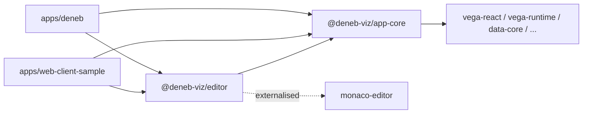

# refactor: extract the editor package from app-core

## Summary

Land the extraction as two PRs under #757. PR 1 stays inside `packages/app-core`: it makes the store composable, removes every core-to-editor state write and every Monaco reference from the viewer side, retires the transitional root-barrel exports, and deletes dead code, while the editor code still lives in app-core. PR 2 is the mechanical extraction: scaffold `packages/editor`, move the files listed in the manifest, rewrite imports, add the build config and the canaries. Each PR carries the proof it can actually satisfy.

---

## Problem Frame

app-core has grown into the whole application; the editor entry reaches 261 of 271 source files and the root barrel leaks 66 editor-side files into viewer consumers. The store is monolithic and four core slices write into editor-only slices, two of them by calling an editor slice action directly. Full context is in the origin document.

---

## Requirements

Traced to the origin document (R-IDs match).

**Package shape**

- R1. Everything reachable only from the editor entry moves to `@deneb-viz/editor`; the unreferenced remap-fields feature is deleted.
- R2. app-core keeps provider, viewer, viewport gate, viewer-live state, platform contract, i18n, template import and template-metadata.
- R3. Strictly one-way dependency: editor depends on app-core, never the reverse.
- R4. app-core's `./editor` subpath is removed.
- R5. The transitional root-barrel re-exports are retired; the visual imports those symbols from the editor package.

**State**

- R6. Editor-only slices (editor, export, debug, settings-pane, field-usage, commands) move; viewer-live slices (interface, compilation, project, visual-render, dataset, i18n, editor-preferences, migration, create) stay.
- R7. Applications compose the store from core slices plus the editor slices they mount.
- R8. Consumers keep a single store and the existing hooks.
- R9. Core slices never write into editor-only slices; core works with no editor slice present.

**Project-create split**

- R10, R11. Template import is a viewer-safe core feature; the editor's create pane composes it.

**Monaco and editor coupling**

- R12, R13. app-core has zero Monaco coupling, including types; the editor package owns Monaco, the JSON worker and schema assets.

**Build and packaging**

- R14, R15, R16. tsdown build under the #750 conventions; singleton packages and app-core externalised; Turbo ordering pinned.

**Behaviour preservation and proof**

- R17. No user-visible behaviour, capability, setting or persisted-property change.
- R18, R19. Parity tool strict-PASS on all non-content parts against each PR's fork point; `visual.js` within 1% of baseline by byte probe.
- R20, R21, R22. Editor-free viewer canary, dependency-direction canary, boundaries lint carried to the new package.

**Consumers**

- R23, R24, R25. Visual and web sample consume both packages; full CI passes.

**Origin acceptance examples:** AE1 (R3, R21), AE2 (R7, R20), AE3 (R9), AE4 (R10, R11), AE5 (R17, R18, R19), AE6 (R5, R23).

---

## Scope Boundaries

- No second visual, app, capabilities set, GUID or branding.
- No viewer-only import shell or read-mode UX.
- app-core's root barrel is trimmed, not replaced by subpath entries.
- No bundle slimming beyond what falls out of the cut.
- Settings-pane platform contributions stay in `apps/deneb`.
- Locale strings stay in app-core's single `en-US.json`; the editor package ships no locale file in this step.
- The platform-provider contract keeps its optional settings-pane fields; the type leak is cosmetic and accepted.

### Deferred to Follow-Up Work

- Fold the flat editor keys (`editorSelectedOperation`, `editorFocusTick`, `editorPreviewAreaSelectedPivot`, `editorZoomLevel`, `requestEditorFocus`) into the nested `editor` object: editor-internal cleanup after the move.
- Split locale strings per package once a viewer-only consumer exists to benefit.
- Split the platform-provider contract into core and editor halves alongside any future store work.
- Refresh the stale syncpack Monaco version group beyond the minimum the move forces.
- Step 3 of the restructure (Power BI host layer out of `apps/deneb`).

---

## Context & Research

### Relevant Code and Patterns

- Store assembly: `packages/app-core/src/state/state.ts` builds one intersection type over fifteen slices and one `createWithEqualityFn(devtools(...))` call; every slice creator is typed against the full store, which is what lets core slices write editor slices. `createDenebState` is exported but a module-level singleton is also created and exported; the visual reads that singleton directly from 32 files with no provider.
- Cross-slice writes: `state/compilation.ts` (`handleCompile`) and `state/field-usage.ts` (`handleApplyTrackingChanges`) write command-enablement flags via the pure helpers in `lib/commands/state.ts`; `state/dataset.ts` (`handleUpdateDataset`) writes `create` and `export.metadata`; `state/project.ts` writes `export.metadata` in four actions and calls `get().editor.updateChanges(...)` in `initializeFromTemplate` and `setContent`. `state/create.ts` and `state/project.ts` also write the flat `editorSelectedOperation` key.
- Monaco coupling on the viewer side: `lib/monaco/types.ts` (type-only), `lib/editor/specification-editor-refs.ts`, `context/specification-editor/*` (module-level `specificationEditorRefs` singleton, the documented escape hatch), `lib/commands/actions.ts` (persist/discard/apply), and `features/project-create/components/create-button.tsx` (sets editor text and focus after create).
- Template-metadata reaches the field-usage slice in mapping mode: `components/template-metadata/template-dataset.tsx` and `data-field-dropdown.tsx`.
- Export routing gap: `GatedDenebViewer` lives in `app/` but is exported only from `src/editor.ts`; `apps/deneb/src/app/app.tsx` imports it and `RetainedDenebEditor` in one statement from the editor subpath.
- Build: `packages/app-core/tsdown.config.ts` (dual entry, `rawWorkerText` and `pngDataUrl` plugins, `deps.neverBundle` list) and `tsdown.worker.config.ts` (two single-entry IIFE configs, hand-curated `alwaysBundle`). `packages/app-core/turbo.json` pins `@deneb-viz/json-processing#build`. `packages/vega-react` is still on plain tsc and is not a template.
- Consumers: `apps/deneb/webpack.common.config.js` has no per-package aliases except a fail-fast `ajv` alias pointing into `packages/app-core/node_modules/ajv`; ts-loader includes `@deneb-viz/*`. `apps/web-client-sample/vite.config.ts` is minimal.
- Sync: `apps/deneb/src/lib/state/sync.ts` syncs project, editor-preferences, visual-render and compilation only, all core; `create-slice-sync.ts` is generic over the store type.
- Canaries: `apps/deneb/src/__test__/invariants/package-singleton-contract.test.ts` and `package-lint-coverage.test.ts` glob `packages/*`; `packages/app-core/src/__tests__/architecture-boundaries.test.ts` runs ESLint programmatically against `packages/app-core/eslint.config.js`, whose element patterns are `src/`-relative and name `src/(index|editor).ts` as the entry layer.
- Locale extension: `state/i18n.ts` `setLocale({ translationExtensions })`, used by `apps/deneb/src/index.ts` at two call sites.
- ajv: the only app-core importer is `lib/schema/schema-service.ts` (editor-side); `json-processing` has its own.
- Parity: `bin/verify-package-parity.ts` takes two `.pbiviz` paths; recipe in `docs/plans/2026-09-14-003-tsdown-migration-plan.md` step 1.

### Institutional Learnings

- `docs/plans/2026-09-14-003-tsdown-migration-plan.md`: six config landmines (worker filename pinning, raw-worker-text port, externals as regexes, `fixedExtension` off, `clean: false` before worker read, hand-curated `alwaysBundle`).
- `docs/plans/2026-09-04-001-apps-deneb-move-plan.md`: baseline built from the branch fork point; parity tool as the acceptance gate.
- `docs/solutions/design-patterns/module-level-singleton-escape-hatch-for-context-refs-2026-05-27.md`: dual-access pattern for `specificationEditorRefs`; it moves as a unit with its provider.
- `docs/solutions/design-patterns/usecontext-guard-needs-nullable-default-2026-05-26.md`: audit moved contexts for nullable defaults.
- `docs/solutions/integration-issues/two-live-vega-embeds-after-editor-retention-2026-07-16.md`: retained editor and gated viewer derive activity from one store value; do not disturb.
- `docs/solutions/best-practices/singleton-worker-addEventListener-ownership-filter-2026-04-28.md`: worker handler ownership; workers move unchanged.
- `docs/solutions/workflow-issues/stale-package-dist-after-watcher-death-2026-07-20.md`: verify dist mtime before debugging "no effect" during the move.

### External References

- None needed; local patterns cover every layer touched.

---

## Key Technical Decisions

- **Two PRs, logic before moves.** PR 1 changes behaviour-adjacent code inside app-core; PR 2 is a mechanical move. Reviewers never see logic changes and file moves in the same diff, and PR 2's baseline is PR 1's merge commit.
- **Parity bar.** The module-renumbering proof does not hold: PR 1 changes logic and PR 2 re-chunks app-core's dist so webpack module bodies differ. Both PRs prove non-content parts strict-PASS, a `visual.js` byte delta within 1%, the full suite, and a Desktop smoke checklist (see origin R18).
- **Store composition via two state types, interface augmentation and explicit install.** A core-only state type is the generic for every core slice creator and for store construction, so `createDenebState` builds from core slices alone and type-checks in PR 1. The augmentable `StoreState` interface extends the core type; the exported hook and getter are typed against it through one documented cast at the composition point, which the install call makes true at runtime. Editor slice creators are typed against `StoreState`. Editor slices declare a module augmentation extending it and are installed into the existing singleton by one exported `installEditorState()` that apps call at startup. One store, one devtools instance, same hooks (R7, R8). The install helper accepts a store instance and defaults to the singleton, so the per-test `createDenebState()` idiom in `packages/app-core/src/state/__tests__/project.test.ts` can install editor slices onto a fresh store. Because core slice creators cannot name editor state from PR 1 onward, R9 is compiler-enforced immediately, not only after PR 2. The editor side reads its state through an accessor that throws a clear message when the editor slices are not installed, so a missed or mis-sequenced install fails at the first read rather than later inside an effect; the always-mounted retained editor is its first consumer. In PR 1 the augmentation targets the local state module and cannot hit the DTS-bundling risk; in PR 2 it targets `@deneb-viz/app-core`. Rejected alternatives: a core store factory taking extra slice creators (the visual reads `getDenebState()` imperatively in its constructor before React mounts and 32 files import the singleton directly, so a factory still needs a module-level instance); an app-owned store passed through the provider (rewires every sync subscriber and imperative read, against R8); a separate editor store (breaks single-selector reads spanning core and editor slices, doubles devtools instances and install-ordering hazards).
- **Decoupling shape, per write.** Command enablement written by compilation and field-usage becomes editor-side derived selectors over the same pure helpers; compilation must stop _reading_ `editor.isDirty` and `editorZoomLevel` as well as writing, or a core-only store throws on the missing slice. Export metadata is not a pure derivation: the export pane edits it independently (`setMetadataPropertyBySelector`, preview image) and `reconcileExportDatasetFields` preserves previously user-edited field properties, so it stays stored and is recomputed upsert-style by an editor-side subscription on project and dataset changes. The editor's staged-text refresh becomes an editor-side subscription on project spec and config; Zustand fires subscribers synchronously inside the triggering `set`, so no render observes an intermediate state. The flat editor keys that project writes today are set editor-side, with the discriminator question recorded under Deferred to Implementation. The editor slice's own writes into commands, export and field-usage are editor-to-editor and are not part of the R9 work.
- **Monaco leaves core wholesale.** `lib/monaco`, `lib/editor/specification-editor-refs.ts`, `context/specification-editor` and `lib/commands` are editor-side. The create button no longer touches editor refs; the editor's subscription refreshes Monaco text. The visual's apply-changes toast imports refs and commands from the editor package (R12).
- **Template-metadata mapping mode is injected.** The mapping-mode reducer comes in as a prop from the editor caller, so template-metadata stays core with no field-usage type reference.
- **Transitional API retires in PR 1.** The root barrel's editor-side re-exports move to the `./editor` entry in PR 1, and the visual imports them from there; PR 2 only flips the specifier. This lets the editor-free viewer canary land in PR 1.
- **Boundaries lint as a shared factory.** `@deneb-viz/eslint-config` gains a `boundaries` factory parameterised by which layer folders exist; both packages consume it. The vitest canary is small and is copied per package.
- **Dead code deleted, not moved.** remap-fields (no importer) and the `pngDataUrl` tsdown plugin (no `.png` importer) are removed in PR 1.
- **Package name** `@deneb-viz/editor` at `packages/editor`, matching the roadmap and existing scoped naming.
- **ajv alias repointed**, since app-core stops depending on ajv; the fail-fast check keeps its intent.

---

## Open Questions

### Resolved During Planning

- Store composition mechanism: a core-only state type for slice creators and construction, an augmentable `StoreState` for consumers, one cast at the composition point, explicit install into the existing singleton (see Key Technical Decisions). The cast is the only escape hatch; a core-only store still type-rejects any editor reach.
- Syncpack, the sync-metadata script and the certification-root-surface canary: no registration needed. Syncpack and `bin/sync-package-metadata.ts` glob `packages/*`; `apps/deneb/src/__test__/invariants/certification-root-surface.test.ts` checks only the root manifest.
- Each cross-slice write: derive (commands), subscribe (export metadata, editor staged text), unchanged (dataset → create, both core).
- Monaco-free refs contract: none; refs and commands move to the editor.
- Boundaries config reuse: shared factory in eslint-config, canary copied.
- Parity baseline per PR: built from each PR's own fork point.
- Move manifest: computed by the reachability audit; reproduced in the Move Manifest section.
- Locale ownership: strings stay in core.

### Deferred to Implementation

- The create-versus-sync discriminator. Both focus-after-create and selecting the Spec pane after create are triggered today inside `initializeFromTemplate`; a subscription on project spec and config alone fires equally for `setContent` and host-driven `syncProjectData`, which must not reset the pane or steal focus. Candidate discriminator: the interface slice's modal-dialog role transitioning to none, but `handleSyncProjectData` also reaches that state on reload, so the chosen signal must be verified against a Desktop reload of an initialised project as well as a fresh create.
- Subscriber registration order between the editor install and the visual's store-synchronisation subscribers is currently benign because persistence never reads editor state; record that as a stated invariant in a comment at the install site.
- Whether tsdown's DTS bundler preserves the `declare module '@deneb-viz/app-core'` augmentation in the editor package's emitted types; if not, the editor exports a typed alias of the same hook object.
- Exact `alwaysBundle` contents for the editor package's two workers, verified by the tsdown-migration inventory checks.
- How `dist/index.css` is produced today (three source files import CSS; no static stylesheet exists) and whether the editor package needs the same handling.
- Whether the `ajv` alias should point at the editor package's `node_modules` or at the hoisted copy; decided by inspecting `npm ls ajv` after the dependency moves.

---

## High-Level Technical Design

> _This illustrates the intended approach and is directional guidance for review, not implementation specification. The implementing agent should treat it as context, not code to reproduce._

Package graph after PR 2:



Store composition (directional):

```text
app-core/state
  type CoreStoreState = core slices                    // generic for core slice creators + construction
  interface StoreState extends CoreStoreState {}       // augmentable; what consumers see
  createDenebState(deps) -> store built from core slices only
  useDenebState / getDenebState                        // the singleton, unchanged names,
                                                       // typed as StoreState via one cast here

editor/state
  declare module '@deneb-viz/app-core' { interface StoreState extends EditorSlices {} }
  installEditorState():
    if already installed -> return
    store.setState(editor slice creators applied to store.setState/getState/store)
    store.subscribe(project content selector, refresh staged editor text)
    store.subscribe(project + dataset selector, recompute export metadata)
  command enablement: selectors over lib/commands/state helpers, not stored
  editor state accessor: throws "editor state not installed" on first read if install was missed

apps
  installEditorState() once at startup, before any editor read
```

---

## Output Structure

```text
packages/editor/
  package.json            exports ".", peers: app-core, powerbi-compat, vega-runtime, vega-react, fluent, react, vega, vega-lite
  tsdown.config.ts        entry src/index.ts; rawWorkerText plugin; neverBundle incl. app-core
  tsdown.worker.config.ts two IIFE worker configs (moved from app-core)
  tsconfig.json, tsconfig.worker.json
  eslint.config.js        boundaries factory from @deneb-viz/eslint-config
  turbo.json              build dependsOn @deneb-viz/app-core#build
  vitest.config.ts
  src/
    index.ts              DenebEditor, RetainedDenebEditor, installEditorState, editor-side primitives the visual needs
    app/                  deneb-editor, retained-deneb-editor, use-editor-mode-sync, editor/**
    features/             command-bar, compiled-vega, debug-area, project-export, settings-pane, specification-editor, project-create (catalog half)
    catalog/
    context/              specification-editor, cursor-context
    lib/                  commands, monaco, editor, schema, field-processing, perf, clipboard, dataset, spec-utils, vega (compilation, i18n)
    state/                editor, export, debug, settings-pane, field-usage, commands, augmentation, install
    __tests__/            architecture-boundaries canary
```

---

## Implementation Units

### Phase 1: PR 1, app-core internal refactor

- U1. **Delete dead code**

**Goal:** Remove the remap-fields feature and the PNG data-URL tsdown plugin, neither of which has an importer.

**Requirements:** R1

**Dependencies:** None

**Files:**

- Delete: `packages/app-core/src/features/remap-fields/**`
- Modify: `packages/app-core/tsdown.config.ts` (remove `pngDataUrl`)

**Approach:**

- Confirm with a repo-wide search that nothing outside the folder references the feature and that no source file imports a `.png`, then delete.
- The create slice's `createFromTemplate` action has no caller (the create button calls `project.initializeFromTemplate` directly); confirm and delete it too, so U2 and U5 do not characterise or decouple a dead write site.

**Patterns to follow:**

- Prior dead-code removals in the 2026-07 audit PRs.

**Test scenarios:**

- Test expectation: none -- deletion of unreferenced code; the build and suite passing is the check.

**Verification:**

- app-core builds; the suite passes; no reference to the feature, the dead action, or `.png` imports remains.

---

- U2. **Characterization tests for the cross-slice writes**

**Goal:** Pin the observable outcomes of the four core-to-editor writes before they are restructured.

**Requirements:** R9, R17

**Dependencies:** None

**Files:**

- Create: `packages/app-core/src/state/__tests__/cross-slice-writes.characterization.test.ts`

**Approach:**

- Drive `handleCompile`, `handleApplyTrackingChanges`, `handleUpdateDataset`, `initializeFromTemplate`, `setContent`, `setSupportFieldConfiguration` and `applySupportFieldMigrationStamp` on a fresh store and snapshot the resulting `commands`, `export.metadata`, `editor` staged text and dirty state, and `editorSelectedOperation`.

**Execution note:** Characterization-first; these tests are kept and re-pointed at the derived selectors and subscriptions in U4 and U5.

**Patterns to follow:**

- Existing slice tests under `packages/app-core/src/state/__tests__/`.

**Test scenarios:**

- Happy path: compile with a dirty editor sets export command enabled and zoom commands per result.
- Happy path: apply tracking changes recomputes export command from dirty flag and result.
- Happy path: dataset update recomputes create assignment flags and export metadata.
- Happy path: initialize from template seeds export metadata, sets staged spec and config text, selects the Spec operation.
- Happy path: set content updates staged text for both roles.
- Edge case: export metadata unchanged when dataset fields are unchanged.

**Verification:**

- Tests pass unmodified on the pre-refactor store.

---

- U3. **Composable store with explicit editor install**

**Goal:** Make the store composable while preserving the singleton and hooks.

**Requirements:** R7, R8, AE2 (partial)

**Dependencies:** U2

**Files:**

- Modify: `packages/app-core/src/state/state.ts`, `packages/app-core/src/state/index.ts`
- Create: `packages/app-core/src/state/editor-augmentation.ts`, `packages/app-core/src/state/install-editor-state.ts`
- Modify: `packages/app-core/src/editor.ts` (export `installEditorState`)
- Modify: `apps/deneb/src/index.ts` (call install in the constructor before any state read), `apps/web-client-sample/src/main.tsx`
- Test: `packages/app-core/src/state/__tests__/store-composition.test.ts`

**Approach:**

- A core-only state type becomes the generic for every core slice creator and for `createDenebState`, which assembles core slices only. `StoreState` becomes an augmentable interface extending it; the exported hook and getter are typed against `StoreState` through one cast at the composition point, documented as the only escape hatch.
- Editor slice types are attached through a module augmentation of the local state module and their creators are typed against `StoreState`; runtime install applies them to the singleton's own set/get/store and merges the result with one `setState`, guarded for idempotency.
- Editor-side reads go through an accessor that throws a clear message if the editor slices are not installed; the retained editor's per-render read of the focus-request key is the first consumer.
- Editor UI files keep the same hook; core slice files can no longer reference editor state, which is caught by the package's `typecheck` script.
- `StateDependencies` continues to thread `applicationVersion` into the export slice via the install call.

**Patterns to follow:**

- Existing `createWithEqualityFn(devtools(...))` assembly; keep a single devtools wrapper.

**Test scenarios:**

- Happy path: a store created with core slices only exposes every core slice and no editor key.
- Happy path: install adds every editor slice; the same store object identity is returned by the hook and getter.
- Edge case: calling install twice is a no-op (no duplicate subscriptions, no state reset).
- Integration: after install, an editor slice action can read and write core slices; devtools sees one store.

**Verification:**

- The visual and web sample start with install called once; the suite passes; U2 tests still pass.

---

- U4. **Derive command enablement on the editor side**

**Goal:** Stop compilation and field-usage from writing the commands slice.

**Requirements:** R9

**Dependencies:** U3

**Files:**

- Modify: `packages/app-core/src/state/compilation.ts`, `packages/app-core/src/state/field-usage.ts`, `packages/app-core/src/state/commands.ts`
- Create: `packages/app-core/src/lib/commands/selectors.ts`
- Modify: `packages/app-core/src/features/command-bar/components/command-bar.tsx` and any other reader of the derived flags
- Test: `packages/app-core/src/lib/commands/__tests__/selectors.test.ts`; update U2 characterization

**Approach:**

- The headline change is in `handleCompile`: it stops reading `editor.isDirty` and `editorZoomLevel` and stops writing `commands`. On a core-only store the read would throw on the missing slice, so removing the read is what makes AE3 hold.
- Export and zoom command enablement become selectors over `compilation.result`, `editor.isDirty` and `editorZoomLevel`, reusing the pure helpers in `lib/commands/state.ts`; field-usage no longer writes `commands`.

**Patterns to follow:**

- Existing selector usage with `useDenebState((state) => ...)` and `zustand/shallow`.

**Test scenarios:**

- Happy path: selector yields the same enablement the characterization tests captured for each input combination.
- Edge case: no compilation result yields all derived commands disabled.
- Integration: command bar re-renders on dirty-flag change without any core slice write.

**Verification:**

- No core slice references `commands`; U2 tests, re-pointed at selectors, pass.

---

- U5. **Editor-side subscriptions for export metadata and staged text**

**Goal:** Remove project and dataset writes into `export` and `editor`, and the flat editor-key writes in create and project.

**Requirements:** R9, AE3

**Dependencies:** U3

**Files:**

- Modify: `packages/app-core/src/state/project.ts`, `packages/app-core/src/state/dataset.ts`, `packages/app-core/src/state/create.ts`
- Modify: `packages/app-core/src/state/export.ts`, `packages/app-core/src/state/editor.ts`
- Modify: `packages/app-core/src/state/install-editor-state.ts` (register subscriptions)
- Test: `packages/app-core/src/state/__tests__/editor-subscriptions.test.ts`; update U2 characterization

**Approach:**

- The export slice owns an upsert reducer over its current metadata, project and dataset state (the same shape as `getUpdatedExportMetadata` today, preserving user-edited fields); a subscription registered at install runs it when project or dataset changes by identity.
- The editor slice subscribes to project spec and config changes and applies its own `updateChanges` for both roles. Selecting the Spec pane and requesting focus after create need a discriminator so `setContent` and host sync do not trigger them; see Deferred to Implementation.
- `dataset → create` stays as is (both core).
- Subscriptions are registered on the store instance passed to the install helper, so fresh-store tests exercise them without the singleton. Document the registration-order invariant against the visual's sync subscribers at the install site.

**Execution note:** Keep the U2 characterization tests green throughout; they define equivalence.

**Patterns to follow:**

- `store.subscribe` with a selector and identity comparison, as in `apps/deneb/src/lib/state/create-slice-sync.ts`.

**Test scenarios:**

- Happy path: initialize from template results in the same export metadata and staged text as before, via subscription.
- Happy path: set content refreshes both roles' staged text.
- Happy path: dataset update recomputes export metadata; unchanged dataset does not.
- Edge case: a core-only store (no install) runs dataset update, compile and project initialization without throwing or touching missing slices. Covers AE3.
- Integration: a store subscriber registered in the test observes staged text and dirty state updated synchronously within the outer action call, before control returns to the caller (assert via `subscribe`, not render timing, which batching can mask).
- Edge case: host-driven project sync and `setContent` with a changed spec do not change the selected pane or request focus; a fresh create does both.

**Verification:**

- No core slice reads or writes `editor`, `export` or `commands`; the four characterization flows produce identical outcomes.

---

- U6. **Monaco-free viewer side**

**Goal:** Ensure nothing on the core side references Monaco types, editor refs, or the field-usage slice.

**Requirements:** R12, R10, R11, AE4

**Dependencies:** U5

**Files:**

- Modify: `packages/app-core/src/features/project-create/components/create-button.tsx`
- Modify: `packages/app-core/src/components/template-metadata/template-dataset.tsx`, `data-field-dropdown.tsx`, `data-assignment-column-cell.tsx`
- Modify: editor-side callers that render template-metadata in mapping mode (`features/project-export/components/export-pane.tsx`)
- Modify: `packages/app-core/src/app/use-deneb-app-setup.ts` and other core files that import the `lib` barrel, to import direct modules
- Test: `packages/app-core/src/features/project-create/__tests__/create-button.test.tsx`, `packages/app-core/src/components/template-metadata/__tests__/data-field-dropdown.test.tsx`

**Approach:**

- The create button dispatches project initialization only; the U5 subscription refreshes editor text. Focus-after-create is handled editor-side (see Deferred to Implementation).
- Template-metadata takes its mapping-mode reducer as a prop; the create path passes the create-slice reducer, the export path passes the field-usage reducer.
- Replace `lib` and `state` barrel imports in core files with direct imports so the reachability walk reflects real dependencies.

**Patterns to follow:**

- This introduces prop-injected reducers; there is no existing precedent. The files being changed, `data-field-dropdown.tsx` and `template-dataset.tsx`, currently read both the create and field-usage reducers from the store and switch on `dialogType` internally; that switch is what the injection replaces.
- app-core tests run in a node environment with no React Testing Library. Test the pure decision logic and payload shapes the way `features/debug-area/components/__tests__/no-data-message.test.tsx` tests its utils module, or mock hooks as `context/specification-editor/__tests__/use-specification-editor.test.ts` does; do not render component trees.

**Test scenarios:**

- Happy path: create from an imported template initializes the project without any editor context mounted. Covers AE4.
- Happy path: with `dialogType` new and the create-slice reducer injected, a field assignment invokes that reducer with the key and supplied-object payload and touches no field-usage state.
- Happy path: with `dialogType` mapping and the field-usage reducer injected by the export pane, the same assignment updates field usage as before; only the injection point differs.
- Error path: the reducer prop is non-optional, so omitting it fails the package's `typecheck` script, run before the PR; no fixture needed.

**Verification:**

- A reachability walk from the viewer entry files finds no `monaco-editor` import and no `context/specification-editor`, `lib/commands` or `lib/monaco` file.

---

- U7. **Retire the transitional root-barrel API and add the viewer canary**

**Goal:** Trim `src/index.ts` to the viewer core, expose `GatedDenebViewer` from the root, move editor-side exports to the `./editor` entry, repoint the visual, and add the editor-free viewer canary.

**Requirements:** R5, R20, R23, AE6 (partial)

**Dependencies:** U6

**Files:**

- Modify: `packages/app-core/src/index.ts`, `packages/app-core/src/editor.ts`, `packages/app-core/src/app/index.ts`
- Modify: `packages/app-core/ARCHITECTURE.md` (remove the transitional exception)
- Modify: the 16 `apps/deneb/src` files that import editor-side symbols from the root barrel, plus `apps/deneb/src/app/app.tsx`
- Create: `packages/app-core/src/__tests__/viewer-entry-is-editor-free.test.ts`, `packages/app-core/src/__tests__/_reachability-walk.ts`

**Approach:**

- Root barrel keeps: provider, viewer, gated viewer, state hooks and core types, platform contract, i18n types, incremental-update configuration, template-import feature, `Hyperlink`.
- Editor entry gains: `installEditorState`, settings-pane primitives, `specificationEditorRefs`, `useSpecificationEditor`, persist/discard commands, perf markers, clipboard, field tracking.
- The walker builds a TypeScript program from `src/index.ts` with the package's own compiler options and collects reachable source files, distinguishing type-only imports from value imports; a regex walker cannot make that distinction and the assertion is about value coupling. It lives beside the test as an underscore-prefixed helper, matching `apps/deneb/src/__test__/invariants/_packages.ts`, and is modified (not copied) in U12.
- The canary asserts the reachable set contains no file under the editor-only paths and no value import of `monaco-editor`, with a non-vacuous guard that the reachable set is non-empty, as every glob-driven canary in the repo carries.

**Patterns to follow:**

- `packages/app-core/src/__tests__/architecture-boundaries.test.ts` for a programmatic canary in test scope; `_packages.ts` for the helper placement; the non-vacuous guard in `package-lint-coverage.test.ts`.

**Test scenarios:**

- Happy path: the reachable set from the trimmed barrel excludes every path under `context/specification-editor`, `lib/commands` and `lib/monaco`, and resolves zero value imports of `monaco-editor`.
- Error path: the violation-detection logic, factored into a pure function over a reachable-file list, reports a synthetic list containing a settings-pane path; no fixture directory is written.
- Edge case: an empty reachable set fails the canary rather than passing vacuously.
- Integration: the visual's interactivity settings render inside the editor's settings pane importing primitives from the editor entry. Partially covers AE6 (app-core side); closes in U11 when the specifier flips to the editor package.

**Verification:**

- PR 1 gate: suite, `ci:local`, parity tool strict-PASS on non-content parts against the fork-point baseline, `visual.js` within 1%, Desktop smoke checklist recorded.

---

### Phase 2: PR 2, the extraction

- U8. **Shared boundaries factory**

**Goal:** Make the layered-boundary lint reusable by two packages.

**Requirements:** R22

**Dependencies:** U7 merged

**Files:**

- Create: `packages/eslint-config/boundaries.js`
- Modify: `packages/eslint-config/package.json` (exports), `packages/app-core/eslint.config.js`
- Test: `packages/app-core/src/__tests__/architecture-boundaries.test.ts` (unchanged behaviour)

**Approach:**

- Factory takes the list of entry files and the set of layer folders present and returns the elements and the dependency matrix; app-core consumes it with no change in outcome.

**Patterns to follow:**

- `packages/eslint-config/base.js` export shape.

**Test scenarios:**

- Happy path: app-core's canary passes with the factory-produced config.
- Error path: a cross-feature import fixture is still rejected.

**Verification:**

- ESLint output for app-core is identical before and after.

---

- U9. **Scaffold `packages/editor`**

**Goal:** Create the package skeleton with build, lint, test and Turbo wiring, and register it with both apps.

**Requirements:** R14, R15, R16, R13

**Dependencies:** U8

**Files:**

- Create: `packages/editor/package.json`, `tsdown.config.ts`, `tsdown.worker.config.ts`, `tsconfig.json`, `tsconfig.worker.json`, `eslint.config.js`, `turbo.json`, `vitest.config.ts`, `README.md`
- Modify: `apps/deneb/package.json`, `apps/web-client-sample/package.json` (devDependency), `.syncpackrc` (Monaco group), `apps/deneb/webpack.common.config.js` (ajv alias target), `packages/app-core/package.json` (drop Monaco, ajv, allotment and other editor-only deps; drop `./editor` export; drop worker scripts), `packages/app-core/tsdown.config.ts` (single entry, drop worker plugin), delete `packages/app-core/tsdown.worker.config.ts`, `tsconfig.worker.json`

**Approach:**

- Copy app-core's tsdown conventions verbatim, applying the six landmines; `neverBundle` adds `@deneb-viz/app-core` and its subpaths.
- Peer dependencies mirror app-core's plus `@deneb-viz/app-core`; the singleton canary will assert powerbi-compat is peer-only and never-bundled.
- Turbo pins `@deneb-viz/app-core#build`. The package ships a `typecheck` script like app-core's, run manually before each PR.

**Patterns to follow:**

- `packages/app-core/package.json`, `tsdown.config.ts`, `tsdown.worker.config.ts`, `turbo.json`.

**Test scenarios:**

- These are existing glob-driven canaries that pick the new manifest up automatically; no new tests are written here.
- Happy path: `apps/deneb/src/__test__/invariants/package-singleton-contract.test.ts` lists the editor package as a powerbi-compat consumer and passes because the dependency is peer-only and the tsdown config never-bundles it; placing it under `dependencies` would fail this test.
- Happy path: `package-lint-coverage.test.ts` passes because the package has an `eslint` script and an `eslint.config.js`.
- Error path: omitting either lint artefact fails lint coverage before any file moves.

**Verification:**

- `npm install` succeeds; `npm run build` orders app-core before editor; both apps resolve the package.

---

- U10. **Move the editor files and rewrite imports**

**Goal:** Physically relocate every editor-side file per the manifest, with tests, and re-target the augmentation and install at the package boundary.

**Requirements:** R1, R2, R3, R4, R6, R12, R13

**Dependencies:** U9

**Files:**

- Move: every path marked `E` in the Move Manifest, plus `state/editor-augmentation.ts`, `state/install-editor-state.ts` and the editor-only slice files
- Modify: `packages/editor/src/index.ts` (the editor entry's export list from U7), `packages/editor/src/state/editor-augmentation.ts` (target `@deneb-viz/app-core`)
- Modify: every moved file's relative imports that crossed into core become `@deneb-viz/app-core` imports
- Delete: `packages/app-core/src/editor.ts`

**Approach:**

- Use git moves so history follows. Rewrite imports mechanically; only import specifiers change.
- Core-only files that the manifest marks `V` or `I` stay; `app/viewport-match-gate-state.ts` stays and is consumed one-way.
- Audit moved contexts for nullable defaults per the documented pattern.
- `lib/monaco/monaco-integration.ts` imports the built JSON worker by a relative path into its own package's `dist/worker`; confirm the folder depth is unchanged after the move so that literal still resolves.

**Patterns to follow:**

- `apps/deneb` move in PR #764 for the mechanical approach.

**Test scenarios:**

- Moved tests run in the editor package unchanged except for import paths.
- Test expectation for type enforcement: none -- app-core has no dependency on the editor package, so any leftover editor-slice reference is an unresolvable import and fails the build.
- Integration: the web sample and the visual mount the editor from the new package and open, edit, apply, discard, export.

**Verification:**

- Both packages build, lint and test; app-core's dist contains no Monaco, worker or catalog code.

---

- U11. **Consumer wiring**

**Goal:** Point both apps at the new package.

**Requirements:** R23, R24, R5, AE6

**Dependencies:** U10

**Files:**

- Modify: `apps/deneb/src/index.ts` (install import), `apps/deneb/src/app/app.tsx`, the 16 files repointed in U7 (specifier flips from `@deneb-viz/app-core/editor` to `@deneb-viz/editor`), `apps/deneb/src/features/toaster/components/notification-apply-changes.tsx`
- Modify: `apps/web-client-sample/src/App.tsx`, `apps/web-client-sample/src/main.tsx`

- Create: `apps/deneb/src/__test__/invariants/editor-import-specifiers.test.ts`

**Approach:**

- Specifier-only changes; no logic.
- A source-scanning canary derives the repointed file set programmatically instead of hard-coding the sixteen names.

**Patterns to follow:**

- `apps/deneb/src/features/toaster/__test__/notification-apply-changes-imports.test.ts` for static import-source assertions; `package-singleton-contract.test.ts` for the `it.each` shape.

**Test scenarios:**

- Happy path: no file under `apps/deneb/src` imports from the retired `@deneb-viz/app-core/editor` subpath.
- Happy path: at least one file under `apps/deneb/src` imports from `@deneb-viz/editor` (non-vacuous guard).
- Happy path: the apply-changes import guard asserts refs and commands come from `@deneb-viz/editor` and not from app-core.

**Verification:**

- `npm run dev` and the Vite sample run; the visual's editor round-trip works in Desktop.

---

- U12. **Canaries, docs and PR 2 gate**

**Goal:** Enforce dependency direction and layering in the new package, update documentation, and run the PR 2 proof.

**Requirements:** R20, R21, R22, R18, R19, R25, AE1, AE2, AE5

**Dependencies:** U11

**Files:**

- Create: `apps/deneb/src/__test__/invariants/package-dependency-direction.test.ts`, `packages/editor/src/__tests__/architecture-boundaries.test.ts`
- Modify: `packages/app-core/src/__tests__/viewer-entry-is-editor-free.test.ts` and `_reachability-walk.ts` (also assert no `@deneb-viz/editor` import), `packages/app-core/ARCHITECTURE.md`, `CLAUDE.md`, `docs/DEVELOPMENT.md` (package list, build order), `packages/editor/README.md`

**Approach:**

- Direction canary has two checks: app-core's manifest has no entry for the editor package in any dependency map, and no file under app-core's source contains the editor package specifier (a flat text search, not a reachability walk). Detection is a pure function over manifest and source text so the negative test passes an in-memory object rather than writing a fixture, following how `_packages.ts` separates disk reading from assertions.
- Dist inventory is a manual check recorded in the PR description, as the tsdown migration did: app-core's dist has no worker files and no Monaco reference; the editor's dist has both workers and an externalised Monaco import.
- Boundaries canary is a copy of app-core's pointed at the editor package's config.
- Build a certified package from PR 1's merge commit as the baseline and from the branch as the candidate; run the parity tool; byte-probe `visual.js`; complete the smoke checklist.

**Patterns to follow:**

- `apps/deneb/src/__test__/invariants/package-singleton-contract.test.ts`, `_packages.ts`.

**Test scenarios:**

- Happy path: app-core's manifest lists no editor dependency and its sources contain no editor specifier. Covers AE1.
- Error path: the detection function reports a violation for an in-memory manifest listing the editor package under dependencies, and for a source text containing the specifier.
- Happy path: viewer canary passes with the package boundary. Covers AE2.
- Happy path: editor boundaries canary passes; a cross-feature import is rejected.

**Verification:**

- PR 2 gate: suite, `ci:local`, parity non-content strict-PASS, `visual.js` within 1% of the PR 1 baseline, smoke checklist recorded. Covers AE5.

---

## Move Manifest

Computed on 2026-09-15 by walking relative imports from the viewer entries (V), the template-import seam (I) and the editor entry (E). Barrel `index.ts` files follow their folder. Re-run the walk after U6 before executing U10; the seam's barrel cleanup may shrink the V and I sets.

| Directory                                                                                                                                                                                           | Core (V + I)                                                                                                                      | Editor (E)                                                                         | Notes                                                                                                                                                                                                       |
| --------------------------------------------------------------------------------------------------------------------------------------------------------------------------------------------------- | --------------------------------------------------------------------------------------------------------------------------------- | ---------------------------------------------------------------------------------- | ----------------------------------------------------------------------------------------------------------------------------------------------------------------------------------------------------------- |
| `app/`                                                                                                                                                                                              | provider, viewer, gated viewer, app setup, viewer.tsx, viewport-match-gate-state                                                  | deneb-editor, retained-deneb-editor(-state), use-editor-mode-sync, `app/editor/**` | gate state shared one-way                                                                                                                                                                                   |
| `catalog/`                                                                                                                                                                                          | none                                                                                                                              | all                                                                                | thumbnails are inline strings; no PNG import                                                                                                                                                                |
| `components/deneb-platform`                                                                                                                                                                         | all                                                                                                                               | none                                                                               |                                                                                                                                                                                                             |
| `components/template-metadata`                                                                                                                                                                      | all                                                                                                                               | none                                                                               | mapping reducer injected (U6)                                                                                                                                                                               |
| `components/ui`                                                                                                                                                                                     | all currently reachable (capped-text-field, hyperlink, status-bar-container, tooltip-custom-mount, layout, modal-dialog, toolbar) | none yet                                                                           | re-check after U6; anything only the editor reaches moves. `toolbar/toolbar-button-standard.tsx` imports the specification-editor context and is reached only by editor features, so it is expected to move |
| `context/`                                                                                                                                                                                          | none after U6                                                                                                                     | specification-editor, cursor-context                                               |                                                                                                                                                                                                             |
| `features/command-bar`, `compiled-vega`, `debug-area`, `project-export`, `settings-pane`, `specification-editor`                                                                                    | none                                                                                                                              | all                                                                                | debug-area includes the data-viewer worker                                                                                                                                                                  |
| `features/project-create`                                                                                                                                                                           | create-button, create-from-template, import-dropzone, no-template-message, template-information, template-placeholder-message     | create-method, select-included-template, visual-create-pane                        | index split accordingly                                                                                                                                                                                     |
| `features/remap-fields`                                                                                                                                                                             | deleted (U1)                                                                                                                      |                                                                                    |                                                                                                                                                                                                             |
| `features/visual-viewer`                                                                                                                                                                            | all                                                                                                                               | none                                                                               |                                                                                                                                                                                                             |
| `i18n/`                                                                                                                                                                                             | all                                                                                                                               | none                                                                               | strings stay in core                                                                                                                                                                                        |
| `lib/application`, `lib/i18n`, `lib/interface`, `lib/project`, `lib/scrollbars`, `lib/platform-search-contract.ts`, `lib/vega/incremental-update-configuration.ts`                                  | all                                                                                                                               | none                                                                               |                                                                                                                                                                                                             |
| `lib/commands`, `lib/monaco`, `lib/editor`, `lib/schema`, `lib/field-processing`, `lib/perf`, `lib/clipboard.ts`, `lib/dataset`, `lib/spec-utils.ts`, `lib/vega/compilation.ts`, `lib/vega/i18n.ts` | none                                                                                                                              | all                                                                                | includes the JSON worker                                                                                                                                                                                    |
| `state/`                                                                                                                                                                                            | state, index, compilation, create, dataset, editor-preferences, i18n, interface, migration, project, visual-render                | editor, export, debug, settings-pane, field-usage, commands, augmentation, install |                                                                                                                                                                                                             |

---

## System-Wide Impact

- **Interaction graph:** the create flow (template import and catalog), apply/persist/discard, editor open with retention, dataset update while the editor is closed, template export, version-change modal and hotkeys all cross the boundary; each is exercised by a unit above and by the smoke checklist.
- **Error propagation:** a missing install is a programming error; every editor-side state read goes through the accessor that throws a clear message when the editor slices are absent, so the failure surfaces at the first read (the retained editor's first render in the visual), not later inside an effect.
- **State lifecycle risks:** subscription ordering (U5) and double install (U3) are the two new lifecycle hazards; both have tests.
- **API surface parity:** app-core's public surface shrinks; the editor package's surface is the former editor entry plus the retired transitional exports. Web sample and visual are the only consumers.
- **Integration coverage:** the Desktop smoke checklist per PR: cold viewer load, open editor, create from catalog, import a template file with field mapping, edit and apply, discard via toast, export, debug pane data and signals, settings pane with the visual's interactivity contributions, return to viewer with no bounce, version-change modal on a downgraded spec, and reopening an already-initialised report (close and reopen in Desktop) with the selected pane and focus confirmed unchanged.
- **Unchanged invariants:** the powerbi-compat singleton contract, the retained-editor and gated-viewer activity derivation, host sync of project, editor-preferences, visual-render and compilation, locale extension, persisted properties.

---

## Risks & Dependencies

| Risk                                                                                              | Mitigation                                                                                                                         |
| ------------------------------------------------------------------------------------------------- | ---------------------------------------------------------------------------------------------------------------------------------- |
| Subscription-based staged-text refresh changes timing versus the in-action call                   | Characterization tests from U2 define equivalence; synchronous-subscriber assertion in U5; smoke checklist covers create and apply |
| A create-versus-sync discriminator misfires on Desktop reload and resets the pane or steals focus | U5 edge-case test covers sync and `setContent`; smoke checklist includes reload of an initialised project                          |
| Subscriber registration order between editor install and the visual's sync subscribers            | Currently benign (persistence never reads editor state); stated as an invariant at the install site                                |
| DTS bundler drops the module augmentation                                                         | Deferred check; fallback is an exported typed alias of the same hook object                                                        |
| Worker `alwaysBundle` regression in the new package                                               | Reuse the tsdown-migration inventory checks; grep dist for worker files and Monaco absence in app-core                             |
| Parity report cannot isolate moved-code equivalence                                               | Two-PR split keeps logic changes reviewable; size bound and smoke checklist stand in for the renumbering proof                     |
| Hoisting changes for ajv or Monaco once dependencies move                                         | Fail-fast alias check stays; `npm ls` inspection in U9                                                                             |
| Editor-only strings remain in core                                                                | Accepted; deferred split                                                                                                           |

---

## Documentation / Operational Notes

- Update `CLAUDE.md` and `docs/DEVELOPMENT.md` package lists and build order; update `packages/app-core/ARCHITECTURE.md` to drop the transitional exception and describe the augmentation/install pattern.
- Record both parity reports and byte probes in the PR descriptions, as #750 did.
- Developers running `npm run dev` after PR 2 should restart it fully so the new package's watcher starts.

---

## Sources & References

- **Origin document:** [docs/brainstorms/2026-09-15-editor-package-extraction-requirements.md](docs/brainstorms/2026-09-15-editor-package-extraction-requirements.md)
- Related plans: `docs/plans/2026-09-14-003-tsdown-migration-plan.md`, `docs/plans/2026-09-04-001-apps-deneb-move-plan.md`, `docs/plans/2026-05-21-app-core-architecture-normalization.md`
- Related code: `packages/app-core/src/state/state.ts`, `packages/app-core/src/index.ts`, `packages/app-core/src/editor.ts`, `bin/verify-package-parity.ts`
- Related PRs/issues: #757, #764, #765, #750, #768
